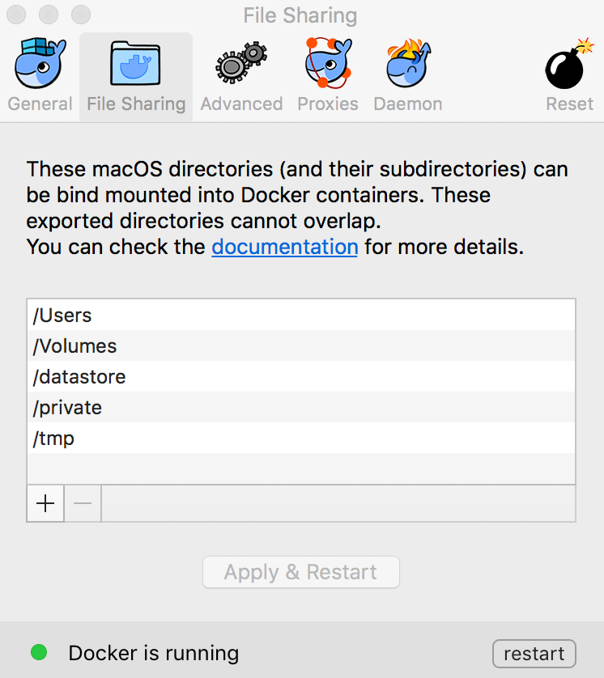

# dcc-dockstore-tool-runner

A Dockstore tool designed to perform file downloads from Redwood, run another Dockstore tool, and then prepare a metadata.json and upload results to Redwood.

## Running Locally

Normally you would not run directly, you are always going to run this via Dockstore or, maybe, via Docker.  For development purposes, though, you may want to setup a local environment for debugging and extending this tool.

## Install Deps

### Ubuntu 14.04

You need to make sure you have system level dependencies installed in the appropriate way for your OS.  For Ubuntu 14.04 you do:

    sudo apt-get install python-dev libxml2-dev libxslt-dev lib32z1-dev

### Python and Packages

Use python 2.7.x.

See [here](https://www.dabapps.com/blog/introduction-to-pip-and-virtualenv-python/) for information on setting
up a virtual environment for Python.

If you haven't already installed pip and virtualenv, depending on your system you may
(or may not) need to use `sudo` for these:

    sudo easy_install pip
    sudo pip install virtualenv

Now to setup:

    virtualenv env
    source env/bin/activate
    pip install jsonschema jsonmerge openpyxl sets json-spec elasticsearch semver luigi python-dateutil setuptools==28.8.0 cwl-runner cwltool==1.0.20160712154127 schema-salad==1.14.20160708181155 avro==1.8.1 typing

Alternatively, you may want to use Conda, see [here](http://conda.pydata.org/docs/_downloads/conda-pip-virtualenv-translator.html)
 [here](http://conda.pydata.org/docs/test-drive.html), and [here](http://kylepurdon.com/blog/using-continuum-analytics-conda-as-a-replacement-for-virtualenv-pyenv-and-more.html)
 for more information.

    conda create -n dockstore-tool-runner-project python=2.7.11
    source activate dockstore-tool-runner-project
    pip install jsonschema jsonmerge openpyxl sets json-spec elasticsearch semver luigi python-dateutil setuptools==28.8.0 cwl-runner cwltool==1.0.20160712154127 schema-salad==1.14.20160708181155 avro==1.8.1 typing

### Patch CWLTools

Unfortunately, we need to patch `cwltool` so we can properly handle calling nested Docker containers through it.  Specifically, we need to pass in the Docker socket and also ensure the working directory paths are consistent between the various layers of Docker calls.  If you have installed cwltool via pip in a virtualenv or conda environment make sure you patch that one and not the system version.  Customize the below for your environment.

    patch -d /usr/local/lib/python2.7/dist-packages/cwltool/ < job.patch

### Install Dockstore CLI

Take a look at http://dockstore.org and go through the onboarding process.

That being said, this particular tool is designed to work with Dockstore CLI 1.0.1.  A copy is located in [dockstore](Dockstore/dockstore) so you can make sure you're using the version that matches the version of cwltool you patched above.

### Redwood Client

You will need a copy of the Redwood client (assuming you are calling the tool outside of docker/dockstore), you can download it from [here](https://s3-us-west-2.amazonaws.com/beni-dcc-storage-dev/ucsc-storage-client.tar.gz).  You will need a token to upload/download data as well.  This assumes you're pulling/pushing to Redwood at UCSC.  If not, you don't need the client or token (instead, for example, you'll pull/push data to S3).

### Make a Temp Dir

So the dcc-dockstore-tool-runner is a Dockstore-based tool that calls another Dockstore-based tool.  This is a complex thing, since it means we need to 1) patch CWLtools to consistently pass in the Docker socket and 2) a common shared data path used by the nested containers.  The patch hardcodes this shared location to be `/datastore` so please create that before running these tools.  

    sudo mkdir /datastore
    sudo chmod a+rwx /datastore

If you're on a mac, make sure you allow Docker to mount this otherwise you'll see an error like:

## Testing

Lowest level to highest level.  The Dockstore CLI pointed to the released version of this tool is the way most users will call this.

### Testing Python Command Directly

The command below will download samples from Redwood, run fastqc from Dockstore on two fastq files, and then upload the results back to a Redwood storage system.  This is a real file and requires controlled access and a token to work.  You need to have cwltool installed/patched, Docker installed.  See above.

    # example with real files
    python DockstoreRunner.py --redwood-path `pwd`/ucsc-storage-client --redwood-token `cat accessToken` --redwood-host storage.ucsc-cgl.org --json-encoded ew0KCSJmYXN0cV9maWxlcyI6IFt7DQoJCSJjbGFzcyI6ICJGaWxlIiwNCgkJInBhdGgiOiAicmVkd29vZDovL3N0b3JhZ2UudWNzYy1jZ2wub3JnL2ZiM2RkODVkLTM2N2UtNWI4ZC05OTI5LTk1MTY0MDg5ZDEwZi83M2YyMzYyNS04ZTU1LTU0MDgtOWY0ZS1hMmRlZDg0MGE2NWQvTkExMjg3OC1OR3YzLUxBQjEzNjAtQV8xLmZhc3RxLmd6Ig0KCX1dLA0KCSJ6aXBwZWRfZmlsZSI6IHsNCgkJImNsYXNzIjogIkZpbGUiLA0KCQkicGF0aCI6ICIvdG1wL2Zhc3RxY19yZXBvcnRzLnRhci5neiINCgl9DQp9 --docker-uri quay.io/briandoconnor/fastqc:0.11.5 --dockstore-url https://dockstore.org/containers/quay.io/briandoconnor/fastqc --workflow-type sequence_upload_qc_report --parent-uuid d2545c4e-dd7d-5a07-b598-e9acba87228f --vm-instance-type m4.4xlarge --vm-region us-west-2 --vm-instance-cores 16 --vm-instance-mem-gb 64 --vm-location aws --tmpdir <path with lots of storage>

This encoded string corresponds to the contents of `sample_fastqc.json`.

To encode and decode online see: https://www.base64encode.org/

### Testing Via cwltool

This may be useful for debugging, it's one layer above calling the python script directly.

NOTE: THE ENVIRONMENT VARIABLE TMPDIR MUST BE SET TO A DIRECTORY WITH ENOUGH SPACE TO HOLD INPUT, OUTPUT AND INTERMEDIATE FILES. Otherwise cwltool will use /VAR/SPOOL/CWL by default which may not have enough space.

    cwltool --debug --enable-dev --non-strict --enable-net  <path to>/Dockstore.cwl --redwood-path `pwd`/ucsc-storage-client --redwood-token `cat accessToken` --redwood-host storage.ucsc-cgl.org --json-encoded  ew0KCSJmYXN0cV9maWxlcyI6IFt7DQoJCSJjbGFzcyI6ICJGaWxlIiwNCgkJInBhdGgiOiAicmVkd29vZDovL3N0b3JhZ2UudWNzYy1jZ2wub3JnL2ZiM2RkODVkLTM2N2UtNWI4ZC05OTI5LTk1MTY0MDg5ZDEwZi83M2YyMzYyNS04ZTU1LTU0MDgtOWY0ZS1hMmRlZDg0MGE2NWQvTkExMjg3OC1OR3YzLUxBQjEzNjAtQV8xLmZhc3RxLmd6Ig0KCX1dLA0KCSJ6aXBwZWRfZmlsZSI6IHsNCgkJImNsYXNzIjogIkZpbGUiLA0KCQkicGF0aCI6ICIvdG1wL2Zhc3RxY19yZXBvcnRzLnRhci5neiINCgl9DQp9 --dockstore-uri quay.io/briandoconnor/fastqc:0.11.5 --parent-uuid d2545c4e-dd7d-5a07-b598-e9acba87228f --tmpdir <path with lots of storage>

### Testing Via Dockstore CLI

Most people, other than developers of this tool, will use the Dockstore CLI to invoke it.  Here's an example running on an Ubutnu box.  Build the docker image:

    # patch in /usr/local/lib/python2.7/dist-packages/cwltool
    # make a tmpdir like /datastore
    docker build -t quay.io/ucsc_cgl/dockstore-tool-runner:1.0.8 .
    # fill in your JSON from Dockstore.json template as Dockstore.my.json
    mkdir /datastore; chown ubuntu:ubuntu /datastore/
    # local execution
    TMPDIR=/datastore dockstore tool launch --entry Dockstore.cwl --local-entry --json Dockstore.my.json
    # as root in /datastore
    TMPDIR=/datastore dockstore tool launch --entry ~ubuntu/gitroot/BD2KGenomics/dcc-dockstore-tool-runner/Dockstore.cwl --local-entry --json ~ubuntu/gitroot/BD2KGenomics/dcc-dockstore-tool-runner/Dockstore.my.json
    # execute published on dockstore (this is the way most people will use this tool!)
    dockstore tool launch --entry quay.io/ucsc_cgl/dockstore-tool-runner:1.0.8 --json Dockstore.my.json

    # running you see it launch the cwltool command, you mind find this useful while debugging
    cwltool --enable-dev --non-strict --enable-net --outdir /datastore/./datastore/launcher-ff6b55b3-52e8-430c-9a70-1ff295332698/outputs/ --tmpdir-prefix /datastore/./datastore/launcher-ff6b55b3-52e8-430c-9a70-1ff295332698/working/ /home/ubuntu/gitroot/BD2KGenomics/dcc-dockstore-tool-runner/Dockstore.cwl /datastore/./datastore/launcher-ff6b55b3-52e8-430c-9a70-1ff295332698/workflow_params.json

## Known Issues

    AttributeError: 'str' object has no attribute 'append'

Looks like a bug in Python 2.7 shipped with MacOS since it was fixed on [Ubuntu](https://bugs.launchpad.net/ubuntu/+source/python2.7/+bug/1048710).

The params section of metadata.json needs to be fixed:

    "workflow_params" : {
      "%s": "%s","%s": "%s","%s": "%s","%s": "%s","%s": "%s","%s": "%s"
    }

## TODO

* need to fix the params issue
